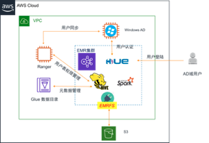
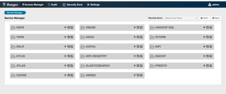
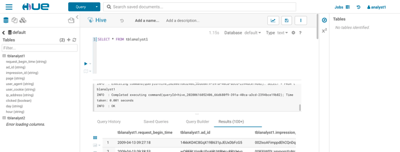
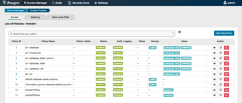

# Ranger 2.0 for EMR中国区安装指导

## AWS上总体架构示意图



## 架构组件描述

- Windows AD：用户身份认证域管理服务器，创建和管理AD域用户，如Admin，Data Analyst, Data Engineer等
- EMR集群：
  - Apache Hue：Windows域用户登陆web端，用于执行Hive命令，与Windows AD身份认证集成
  - Apache Hive：数据仓库，通过EMRFS数据存储在S3上
  - Apache Spark：大数据计算引擎
- Ranger：Hive用户表权限管理配置，HDFS文件系统权限管理配置
- AWS Glue：EMR Hive元数据存储与管理

## 快速安装环境步骤

#### 1.创建S3存储桶

创建S3存储桶,将本repository的文件以及ranger-lib.tgz同步到S3桶内

```bash
git clone git@github.com:yizhizoe/ranger-emr-cn.git
cd ranger-emr-cn
aws s3 cp s3://<public sharing for ranger library>/ranger-lib.tgz ./
tar -xzf ranger-lib.tgz
aws s3 sync ./ s3://<bucket_name>/
```

S3存储桶的目录

```bash
aws s3 ls s3://<bucket_name>/
|-cfn/ CloudFormation部署脚本
|-emrfs/ 
|-inputdata/ 用户Hive/HDFS权限定义文件
|-ranger/ Ranger安装组件，包括1.1，1.2，2.0版本
|-samples/ S3上Hive表的demo数据，广告点击流数据
|-scripts/ CloudFormation中的执行脚本和EMR执行步骤中的脚本
```

#### 2. 创建Windows AD服务器：

Windows Sever2012/16使用create_win_ad.template模板创建

#### 3.创建Ranger服务器：

Amazon Linux2，Ranger 2.0版本 ， 使用ranger-server.template模板创建

#### 4.创建EMR集群和AWS Glue：

EMR 5.29/5.30版本，包括Hadoop，Hue，Hive，Spark等组件 ，使用 launch-emr.template创建

## 详细步骤&注意事项说明

#### Windows AD服务器

- AD服务器绑定EIP，防止IP地址因为机器重启而变化，后面创建Ranger和EMR集群时需要和AD服务器通讯
- 北京区选择AMI: ami-09c7bab48bbc956ef
- 创建一个binduser域账户，具有administrator权限，这是用于将windows ad和ranger打通的用户（也可以直接用administrator用户，但不建议）
- 创建Hadoop Admin，Hadoop Analyst两个用户组，然后在Hadoop Admin用户组下创建admin1用户，在Hadoop Analyst用户组下创建analyst1，analyst2域用户，这些用户会同步到ranger用户中，并且在inputdata文件夹中有这些用户的权限管理文件（已经hard code了）。如果用了其他的用户名，需将inputdata文件夹中的权限文件也做相应修改。

#### Ranger 服务器

- 将cloudformation模板参数中的s3://emr-ranger-workshop换成存放自己安装文件和脚本的s3 bucket
- 因为Ranger服务器启动时会调用install-ranger-admin-server.sh这条安装脚本命令，其中ranger_user_sync安装包中的setup.sh会从海外下载solr-7.7.1.tgz这个包，速度很慢已经改成从s3桶ranger目录下的安装包安装
- Ranger 服务器安装完成好了之后默认登陆用户名，密码是admin/admin,登陆进入之后如下图
- 

#### EMR集群

- 将cloudformation模板中的s3artifactsRepo替换成存放自己安装文件和脚本的s3 bucket
- 将EMRLog dir更换成自己的s3 log 地址
- 默认用的是北京区域，cloudformation模板中EMR step中"Jar": "s3://cn-north-1.elasticmapreduce/libs/script-runner/script-runner.jar",用的是cn-northwest-1.（ZHY直接替换成cn-northwest-1）
- 集群创建好之后可以用域用户直接登录到Hue界面中如下图，analyst1只有访问tblanalyst1的权限
- 

- 不同域用户的Hive或HDFS权限管理在ranger中如下图
- 